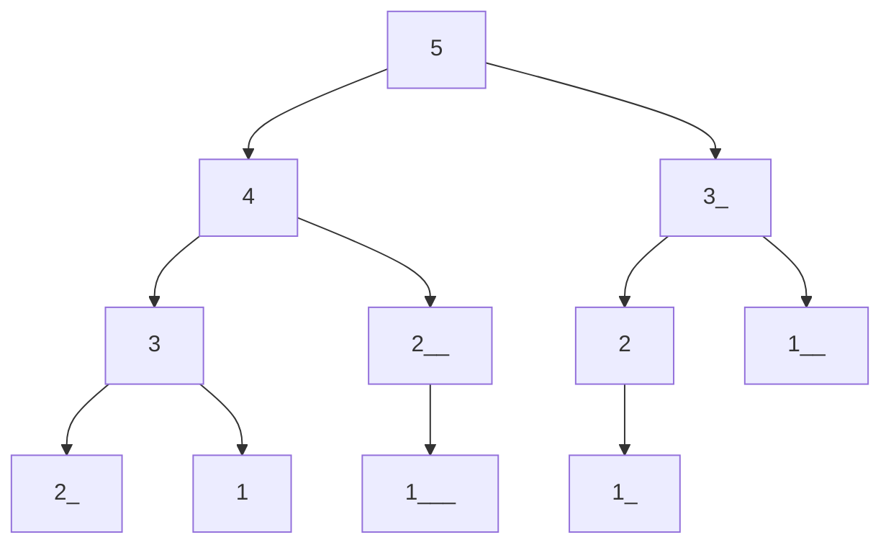

# Dynamic Programming

## Recurrence Relation

## 1. Fibonacci Sequence

The Fibonacci sequence is defined by the recurrence relation:

$$F_n = F_{n-1} + F_{n-2}$$

More formally,

$$
\begin{equation}
F(n)=
    \begin{cases}
        0 & n = 0 \\
        1 & n = 1 \\
        F(n-1) + F(n-2) & n > 1
    \end{cases}
\end{equation}
$$

```python
def fib(n):
    if n < 2:
        return n
    else:
        return fib(n-1) + fib(n-2)
```

Time: $O(2^n)$, gross!

Space: $O(n)$



I tried using mermaid, but it doesn't work well with github markdown. I'll have to look into it more. Basically ignore the underscores because they don't let me make duplicate nodes.

## Memoization

We can store and reuse previously computed values to reduce the running time.

```python
def fib(n, memo):
    if n < 2:
        return n
    if n in memo:
        return memo[n]
    
    memo[n] = fib(n-1, memo) + fib(n-2, memo)
    return memo[n]
```

Our `memo` is a dictionary that maps from `n` to $F(n)$.

Time: $O(n)$ I guess maybe $O(n^2)$ because of the dictionary lookup? But, we could have also used a an array and guaranteed $O(n)$.

```python
memo = [-1] * (n+1)

def fib(n, memo):
    if n < 2:
        return n
    if memo[n] != -1:
        return memo[n]
    
    memo[n] = fib(n-1, memo) + fib(n-2, memo)
    return memo[n]
```

Time: $O(n)$

Space: $O(n)$

## Constant Space

We can reduce the space complexity to $O(1)$ by only storing the last two values.

```python
def fib(n):
    if n < 2:
        return n
    
    first = 0
    second = 1
    for i in range(2, n+1):
        temp = second # save the second value
        second = first + second # compute the new second value
        first = temp # set the first value to the old second value
    
    return second
```

Time: $O(n)$

Space: $O(1)$

## 2. House Robber

The recurrence relation for the house robber problem is:

$$
\begin{equation}
rob(i)= \max
    \begin{cases}
       nums[i] + rob(i + 2), \\
       rob(i + 1)
    \end{cases}
\end{equation}
$$

```python
class Solution:
    def rob(self, nums: List[int]) -> int:
        rob1, rob2 = 0, 0

        for n in nums:
            temp = max(n + rob1, rob2)
            rob1 = rob2
            rob2 = temp
        return rob
```

Time: $O(n)$

Space: $O(1)$

## 3. Longest Increasing Subsequence

```python
    def LIS(nums):
    n = len(nums)
    res = [1] * n

    for i in range(n - 1, -1, -1):
        for j in range(i + 1, n):
            if nums[i] < nums[j]:
                res[i] = max(res[i], 1 + res[j])
    print("DP: ", res)
    return max(res) # O(n) statement
```
