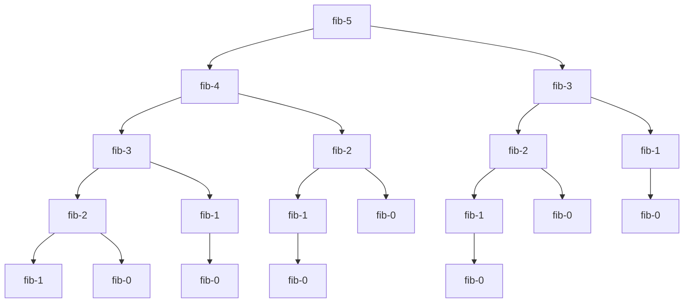

# Dynamic Programming

Dynamic programming is a method for solving a complex problem by breaking it down into a collection of simpler subproblems, solving each of those subproblems just once, and storing their solutions. A good way to think about it is as a "careful" brute force or a "careful" recursion. We only solve the subproblems needed and when we can, reuse the solutions to those subproblems to solve the larger problem.

## General Approach

1. Visualize examples
2. Find appropriate subproblems
3. Find relationships between subproblems
4. Generalize the relationship
5. Think of a recursive approach and implement subproblems in order

## Mathematical Approach

1. Develop a recurrence relation: This is the majority of being able to solve a DP problem. The recurrence relation is the formula that relates the solution to the subproblems to the solution to the larger problem. It is usually a function of the subproblem's solution and the input to the subproblem.
2. Determine if you're solving the correct subproblem: This is the most common mistake. You need to make sure that you're solving the correct subproblem.
    - Determine if there are any overlapping subproblems and if you're solving the same thing multiple times and see if you can reuse the solution.
3. Determine the order of the subproblems: If you're using a bottom up approach versus a top down approach, the order of which you solve the subproblems matters.

## 1. Fibonacci Sequence

The Fibonacci sequence is defined by the recurrence relation:

$$F_n = F_{n-1} + F_{n-2}$$

More formally,

$$
\begin{equation}
F(n)=
    \begin{cases}
        0 & n = 0 \\
        1 & n = 1 \\
        F(n-1) + F(n-2) & n > 1
    \end{cases}
\end{equation}
$$

```python
def fib(n):
    if n < 2:
        return n
    else:
        return fib(n-1) + fib(n-2)
```

Time: $O(2^n)$, gross!

Space: $O(n)$

Below we can see how many unnecessary calls are made to `fib` when we call `fib(5)` and it makes its recursive calls to `fib(5-2)` and `fib(5-1)` and so on. Every repeated call to `fib` that you see is a call that we can avoid by using dynamic programming.



## Memoization

We can store and reuse previously computed values to reduce the running time.

```python
def fib(n, memo):
    if n < 2:
        return n
    if n in memo:
        return memo[n]
    
    memo[n] = fib(n-1, memo) + fib(n-2, memo)
    return memo[n]
```

Our `memo` is a dictionary that maps from `n` to $F(n)$.

Time: $O(n)$ I guess maybe $O(n^2)$ because of the dictionary lookup in the worstcase. But, we could have also used a an array and guaranteed $O(n)$.

```python
memo = [-1] * (n+1)

def fib(n, memo):
    if n < 2:
        return n
    if memo[n] != -1:
        return memo[n]
    
    memo[n] = fib(n-1, memo) + fib(n-2, memo)
    return memo[n]
```

Time: $O(n)$

Space: $O(n)$

## Constant Space

We can reduce the space complexity to $O(1)$ by only storing the last two values.

```python
def fib(n):
    if n < 2:
        return n
    
    first = 0
    second = 1
    for i in range(2, n+1):
        temp = second # save the second value
        second = first + second # compute the new second value
        first = temp # set the first value to the old second value
    
    return second
```

Time: $O(n)$

Space: $O(1)$

## 2. House Robber

The recurrence relation for the house robber problem is:

$$
\begin{equation}
\text{rob(i)}= \max
    \begin{cases}
       \text{nums[i]} + \text{rob(i + 2)}, \\
       \text{rob(i + 1)}
    \end{cases}
\end{equation}
$$

```python
class Solution:
    def rob(self, nums: List[int]) -> int:
        rob1, rob2 = 0, 0

        for n in nums:
            temp = max(n + rob1, rob2)
            rob1 = rob2
            rob2 = temp
        return rob
```

Time: $O(n)$

Space: $O(1)$

## 3. Longest Increasing Subsequence (LIS)

```python
 def LIS(nums):
    n = len(nums)
    res = [1] * n

    for i in range(n - 1, -1, -1): # bottom up
        for j in range(i + 1, n):
            if nums[i] < nums[j]: # if i < j and nums[i] < nums[j]
                res[i] = max(res[i], 1 + res[j])
    print("DP: ", res)
    return max(res) # O(n) statement
```
