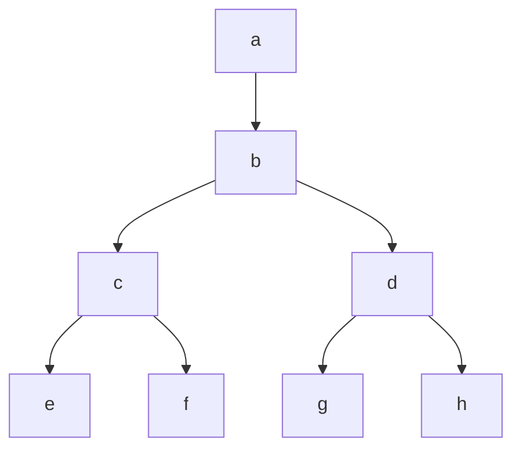

# Trees

Trees in data structures are a way to represent hierarchical data. Consider our previous lectures on Linked-List and Arrays, trees we are in a way combining properties of both. We continue to have the linked structure as we say before in Linked-List, but we can also have a way to order our data efficiently like in Arrays. Trees are a special kind of graph, and a graph is a tree iff unique simply path between any two nodes (can maybe add a proof, this implies they're acyclic). Another important note is that trees are recursive by nature.

## Terminology

### Relationships

- **Root**: The top node in a tree. Can be thought of as the *ancestor* of all the nodes in the tree. Equivalently, the other nodes are *descendants* of the root.
- **Parent**: The node that has a child node.
- **Child**: A node that has a parent node.
- **Siblings**: Nodes that have the same parent. (`node1.parent == node2.parent`)
- **Ancestor**: A node reachable by repeated proceeding from child to parent.
- **Descendant**: A node reachable by repeated proceeding from parent to child.
- **Successor**: A node reachable by repeated proceeding from parent to child. (Same as descendant)
- **Predecessor**: A node reachable by repeated proceeding from child to parent. (Same as ancestor)

### Properties

- **Leaf**: A node that has no children. Also known as an external node. (`left`, `right` = `None`)
- **Edge**: The connection between two nodes. We can think of this as the link between the parent and child node in a binary tree but there are potential representations such as a `firstChild` and `nextSibling`.
- **Path**: A sequence of nodes and edges connecting a node with a descendant.
- **Height**: The maximum depth of any of its nodes. Typically, from the root node to the deepest leaf node.
- **Depth**: Length (number of edges) of the unique path from the root to that node. The root node has a depth of 0.
- **Level**: The set of all nodes at a given depth.
- **Subtree**: A tree consisting of a node and all of its descendants.
- **Complete**: A tree where all levels are completely filled except possibly the last level. The last level is filled from left to right.
  - A complete binary tree of height $h$ has between $2^h$  and $2^{h+1} - 1$ nodes. This implies the height of the tree is $O(\log n)$.
  - Indexing a complete binary tree in array form:
    - `leftChild(i) if (2i <= n) then 2i else None` (if the left child exists, return the index of the left child, else return `None`)
    - `rightChild(i) if (2i + 1 <= n) then 2i + 1 else None` (if the right child exists, return the index of the right child, else return `None`)
    - `parent(i) if (i > 1) then floor(i/2) else None` (if the parent exists, return the index of the parent, else return `None`)
- **Full**: A tree where every node has either 0 or 2 children.
- **Perfect**: A tree where all internal nodes have 2 children and all leaves are at the same level. Thus, to be perfect, a tree must be both full and complete.
- **Balanced**: A tree where the height of the left and right subtrees of every node differ by at most 1.

What properties does the following tree have?



This tree is:

- Balanced
- Full
- Complete
- Perfect

The tree has the following properties:

- Height: 3
- Depth of:
  - `a`: 0
  - `b`: 1
  - `c, d`: 2
  - `e, f, g, h`: 3
- Level:
  - 0: `a`
  - 1: `b`
  - 2: `c, d`
  - 3: `e, f, g, h`

## Traversals

These traversals are easily implemented recursively. We can also implement them iteratively using a stack data structure, this can be thought of as the recursive call stack that is being used during the recursion. Similarly, these traversals are known as depth-first search (DFS) because we are going as deep as possible before going to the next node.

- **Pre-order**: root, left, right

```python
def preorder(root):
    if root:
        print(root.val)
        preorder(root.left)
        preorder(root.right)
```

- **In-order**: left, root, right
  - **Binary Search Tree (BST)**: In-order traversal of a BST will result in a sorted list of values. This is efficient because we can visit all nodes in sorted order in $O(n)$ time where if we collected all the nodes then sorted them, it would take $O(n \log n)$ time.

```python
def inorder(root):
    if root:
        inorder(root.left)
        print(root.val)
        inorder(root.right)
```

- **Post-order**: left, right, root

```python
def postorder(root):
    if root:
        postorder(root.left)
        postorder(root.right)
        print(root.val)
```
